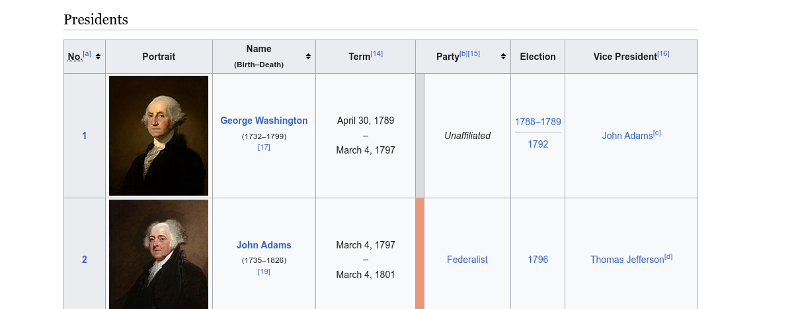

# CS 3030 Flex Challenge Activity Module 6

## Purpose and Skills

In this project, you will develop a Python script that combines web scraping and SQLite database operations to collect and store data from websites. You will also learn about version control using Git and the concept of branches.

Your task is to write a Python script that extract information from a wiki page and it will store the data in a `SQLite` database.

Additionally, you will incorporate Git version control by creating a branch for each major task of the assignment.  


## Task 0: Create virtual environment

Before proceeding further, let's adhere to good development practices. Follow these steps to create a virtual environment using conda named `mod6_ca`. This environment will facilitate the development of our solution:

1. Open your terminal.

2. Execute the following command to create the virtual environment:
   
   ```bash
   conda create -n mod6_ca python=3.10
   ```

   This command creates a new conda environment named `mod6_ca` with Python version `3.10`. You can replace `3.10` with your desired Python version if needed.

3. Activate the virtual environment using the command:
   
   ```bash
   conda activate mod6_ca
   ```

   Once activated, your terminal prompt should indicate that you are within the `mod6_ca` environment.

Now you are all set to develop your solution in an isolated environment, which helps in managing dependencies and ensuring project-specific packages do not conflict with each other.

For this assignment, you will need to install some third party libraries. The modules required are listed in your `requirements.txt` file. 

To install them run the following command:
```bash
pip install -r requirements.txt
```

## Task 1: Parsing input arguments

To begin, create a branch named `task1` using the command `git checkout -b task1`. 

To enhance the script's functionality, incorporate argument parsing by utilizing the `argparse` module. Ensure that the script supports the following command-line options:

- `-h` or `--help` usage
- `-d` or `--database` to specify the sqlite database file.

Next, using the connection functions provided in the `database_conn.py` module, establish a connection to the SQLite database. Ensure that the database connection is properly configured and operational for the subsequent tasks. 

### Sample Output Task 1

```bash
# Print script usage 
./ca.py -h
usage: ca.py [-h] -d database.db

options:
  -h, --help            show this help message and exit
  -d database.db, --database database.db

```

The `-d` parameter is required

```bash
./ca.py
usage: ca.py [-h] -d database.db
ca.py: error: the following arguments are required: -d/--database
```

Successful connection: 
```bash
python ca.py -d  presidents.db
SUCCESS! database connection.
```

The connection and table creation functions are provided for you. 

After completing this task, push your changes to your repository and create a pull request for review. Then, merge your branch to main, but DO NOT delete the testing branch. 

## Task 2: Wiki Page Data Extraction

For the next step, initiate a new branch called `task2` and switch to it using the command `git checkout -b task2`. Follow the instructions below to complete the task: 

In this task, you are going to define a function to extract information form a Wikipedia page. 
The goal of this task is to scrape data from a specific Wikipedia page and return it as a Pandas DataFrame. 


For your reference, please examine the wiki page we are going to extract the data from: 
```
https://en.wikipedia.org/wiki/List_of_presidents_of_the_United_States
```


Task Details: 
Your algorithm to extract the table data should be as follows: 

- Use the requests library to connect to the specified Wikipedia page (`wiki_page`). Check the connection status to ensure success.
- Parse the webpage's content using `BeautifulSoup`. Create a `BeautifulSoup` object to work with the page's HTML.
- Utilize the `find()` method from the `BeautifulSoup` object to locate the table on the webpage containing the desired data.
- For debugging purposes, print the output from the `find()` method to verify that you have correctly located the table data.
- (Optional, but recommended) Convert the data extracted from the table to a Pandas DataFrame. You can use Panda's `read_html()` and `DataFrame()` methods for this purpose. 
- Print the data frame raw data as reference for further analysis. 

### Sample Output Task 2

If you print your data frame, it should look something similar to this:
```bash
python ca.py -d  presidents.db
200
    No.[a]  Portrait  ...             Election                                 Vice President[16]
0        1       NaN  ...       1788–1789 1792                                      John Adams[c]
1        2       NaN  ...                 1796                                Thomas Jefferson[d]
2        3       NaN  ...            1800 1804                          Aaron Burr George Clinton
3        4       NaN  ...            1808 1812  George Clinton[e] Vacant after April 20, 1812 ...
4        5       NaN  ...            1816 1820                                 Daniel D. Tompkins
43      44       NaN  ...            2008 2012                                          Joe Biden
.....
.....
.....
44      45       NaN  ...                 2016                                         Mike Pence
45      46       NaN  ...                 2020                                      Kamala Harris

[46 rows x 8 columns]
```

After completing this task, push your changes to your repository and create a pull request for review. Then, merge your branch to main, but DO NOT delete the testing branch. 

## Task 3: Data Wrangling

For the next step, initiate a new branch called `task3` and switch to it using the command `git checkout -b task3`. 

The objective of this task is to refine and structure the data, focusing on specific columns of interest, and then storing them in a suitable format for further analysis. 

If look at the wiki page again, the main table consist of about 8 columns. For this assignment, we are only interested in the following columns: 

- `No.` column (president number)
- `Name (Birth-Death)` column (president name, birth date, death date)
- `Term column` (term start and term end)

Write code to filter and extract data from these columns. Ensure that you clean any extraneous whitespace or characters from the extracted data.




From the columns above, we need to extract the following information: 

- From the `No.` column. Take the president number.
- From the `Name (Birth-Death)` column. Extract the name, the birth date, and death date as three separate fields. Note: make sure you clean all whitespace. 
- From the `Term` column. Extract the `from` term and `end` term, as two separate fields. Note: make sure you clean all whitespace.

Hint: You could store the filter data in a list of dictionaries. Each element of your list contains a dictionary with the filter data. 


### Sample Output Task 3

Note: At this point you can suppress the output from the previous tasks. 

This sample output shows a list of dictionaries with the filter data per record

```bash
python ca.py -d  presidents.db
[{'number': 1, 'name': 'George Washington', 'birth': '1732', 'death': '1799', 'term_from': 'April 30, 1789', 'term_to': ' March 4, 1797'}, {'number': 2, 'name': 'John Adams', 'birth': '1735', 'death': '1826', 'term_from': 'March 4, 1797', 'term_to': ' March 4, 1801'}, 
....
....
, {'number': 45, 'name': 'Donald Trump', 'birth': '1946', 'death': '', 'term_from': 'January 20, 2017', 'term_to': ' January 20, 2021'}, {'number': 46, 'name': 'Joe Biden', 'birth': '1942', 'death': '', 'term_from': 'January 20, 2021', 'term_to': ' Incumbent'}]
```

Note: I used a list of dictionaries to store my filter data, but you are welcome to use any type of collection. 

Sample Data Structure
```
[
    {
        "No.": "1",
        "Name": "George Washington",
        "Birth_Date": "February 22, 1732",
        "Death_Date": "December 14, 1799",
        "Term_Start": "April 30, 1789",
        "Term_End": "March 4, 1797"
    },
    {
        "No.": "2",
        "Name": "John Adams",
        "Birth_Date": "October 30, 1735",
        "Death_Date": "July 4, 1826",
        "Term_Start": "March 4, 1797",
        "Term_End": "March 4, 1801"
    },
    # ... (data for other presidents)
]

```

After completing this task, push your changes to your repository and create a pull request for review. Then, merge your branch to main, but DO NOT delete the testing branch. 

## Task 4: Store Data

Initiate a new branch called `task4` and switch to it using the command `git checkout -b task4`. 

For the next task, you will complete the integration of the filtered and structure data into a SQLite database. 
This task involves storing the filtered data in the `info` table, which is part of the `president.db` database file. 


To achieve this, implement the `insert_data()` function from the `database_conn.py` module to insert the filtered data into the `info` table. Ensure that the stored data aligns with the structure of the table.  


### Sample Output Task 4

After inserting the data, validate that it is successfully stored in the info table. You can use SQL queries to retrieve data from the table to verify its correctness (uncomment the following line of code to test): 

```python
db.select_data(conn) 
```

Your output should be similar to this: 
```
❯ python ca.py -d  presidents.db
SUCCESS! database connection.
(1, 'George Washington', '1732', '1799', 'April 30, 1789', ' March 4, 1797')
(2, 'John Adams', '1735', '1826', 'March 4, 1797', ' March 4, 1801')
(3, 'Thomas Jefferson', '1743', '1826', 'March 4, 1801', ' March 4, 1809')
(4, 'James Madison', '1751', '1836', 'March 4, 1809', ' March 4, 1817')
(5, 'James Monroe', '1758', '1831', 'March 4, 1817', ' March 4, 1825')
...
...
...
...
(44, 'Barack Obama', '1961', '', 'January 20, 2009', ' January 20, 2017')
(45, 'Donald Trump', '1946', '', 'January 20, 2017', ' January 20, 2021')
(46, 'Joe Biden', '1942', '', 'January 20, 2021', ' Incumbent')

```

After completing this task, push your changes to your repository and create a pull request for review. Then, merge your branch to main, but DO NOT delete the testing branch. 


This task is pivotal in integrating your data scraping and cleaning efforts with data storage. You will store the filtered data in an SQLite database, allowing for future retrieval and analysis. It provides hands-on experience in working with databases and demonstrates your ability to manage and store data systematically.
ng your data scraping and cleaning efforts with data storage. You will store the filtered data in an SQLite database, allowing for future retrieval and analysis. It provides hands-on experience in working with databases and demonstrates your ability to manage and store data systematically.

## Code Walkthrough

As part of your code walkthrough, you'll be demonstrating each task by checking out the corresponding branch and explaining the code at that point. This walkthrough will provide a comprehensive understanding of the development process and the logic behind each task. Follow these steps:

1. `Task 1 Walkthrough`:
   - Start by checking out the `task1` branch using the command `git checkout task1`.
   - Explain how you incorporated the `argparse` module to support command-line options `-d`, and how this option is used to specify the database file. 
   - Show an example command using these options and explain the expected behavior.

2. `Task 2 Walkthrough:`
   - Switch to the `task2` branch using the command `git checkout task2`.
   - Discuss the algorithm used to extract the wiki page table data. 

3. `Task 3 Walkthrough:`
   - Move to the `task3` branch using the command `git checkout task3`.
   - Discuss the algorithm used to clean the data from the table, and your choice for a collection to store the information.

4. `Task 4 Store Data:`
   - Move to the `task4` branch using the command `git checkout task4`.
   - Discuss the algorithm used to store the records in the `info` table.


By following these steps, you'll effectively walk through your codebase while demonstrating the functionality of each task. This walkthrough will help your audience understand how the code evolves with each task and how different features are implemented at each stage of development.